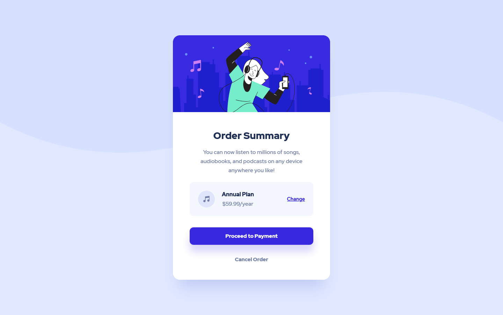

# Frontend Mentor - Order summary card solution

This is a solution to the [Order summary card challenge on Frontend Mentor](https://www.frontendmentor.io/challenges/order-summary-component-QlPmajDUj). Frontend Mentor challenges help you improve your coding skills by building realistic projects! 

## Table of contents

- [Overview](#overview)
  - [The challenge](#the-challenge)
  - [Screenshot](#screenshot)
  - [Links](#links)
- [My process](#my-process)
  - [Built with](#built-with)
  - [What I learned](#what-i-learned)
  - [Continued development](#continued-development)
  - [Useful resources](#useful-resources)
- [Author](#author)

## Overview

### The challenge

Users should be able to:

- See hover states for interactive elements

### Screenshot

Desktop view



### Links

- Solution URL: [Click here](https://www.frontendmentor.io/solutions/mobilefirst-order-summary-card-component-8ia4WpGFI)
- Live Site URL: [See live site here](https://juanbonilla.me/FEM_order-summary-component/)

## My process

### Built with

- Semantic HTML5 markup
- CSS / SCSS custom properties
- Flexbox
- Mobile-first workflow

### What I learned

I decided to take a previous file for font styles from my last project and imported it here (`_mixins.scss`). I needed to replace some things to have a better approach in my code.

See below what I did for the `@mixin` that I included in my project:

```scss
@mixin font-styles ($size, $line-height, $font-weight) {
    font-family: $f-family; // This is a value that comes from _variables.scss
    font-size: $size;
    font-weight: $font-weight;
    line-height: $line-height;
}
```

### Continued development

I want to understand how can I create components that could be reusable for future projects.

### Useful resources

- [Example resource 1](https://www.example.com) - This helped me for XYZ reason. I really liked this pattern and will use it going forward.
- [Example resource 2](https://www.example.com) - This is an amazing article which helped me finally understand XYZ. I'd recommend it to anyone still learning this concept.

## Author

- Website - [juanbonilla.me](https://juanbonilla.me)
- Frontend Mentor - [@juanpb96](https://www.frontendmentor.io/profile/juanpb96)
- LinkedIn - [Juan Bonilla](https://www.linkedin.com/in/juan-pablo-bonilla-6b8730115/)